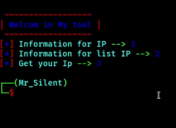

<!-- Github README -->

&nbsp;&nbsp;&nbsp;

# ip_Scan

اداه ip_Scan
 
من برمجة Mr Silent

لمعرفه معلومات عن ايبي اي شخص وايضا من ميزات الاداه فحص ملف به العديد من الايبيهات وايضا تستطيع معرفه الايبي الخاص بك عن طريق الاداه

تنزيل اداة 

git clone https://github.com/hacker-ali-17/ip_Scan.git

cd ip_Scan

تشغيل اداة 

python3 Silent_ip.py 

## صورة اداة 

## Contact

* facebook: [أكادمية تعلم البرمجة حتي الاحتراف
](https://www.facebook.com/Alloush.dz)

